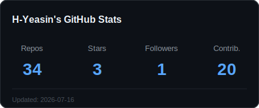
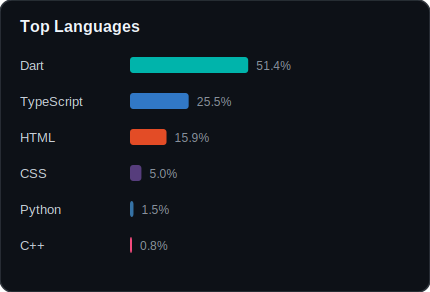

# Hi there, I'm Yeasin! 👋
### Flutter Developer | EdTech Engineer | Clean Architecture Specialist

I bridge the gap between complex engineering and intuitive user experience. With a background in **Educational Technology**, I build applications that are not just functional, but cognitively efficient.

---

### 🛠️ Tech Stack

---

### 🚀 Featured Projects

| Project | Tech Stack | Key Results & Impact | Links |
| :--- | :--- | :--- | :--- |
| **3D Interactive Companion** *(Language Learning Module)* | **Flutter, iOS SceneKit, Web ModelViewer** | • Achieved **60fps** hybrid rendering on iOS. • Implemented **real-time lip-syncing** with TTS. • Reduced app size by streaming assets. | [**View Demo**](https://yeasin84.github.io/myPortfolio/) [**Read Case Study**](LINK_TO_ARTICLE) |
| **AroggyaPath** *(Healthcare Platform)* | **Flutter, Firebase, Clean Architecture** | • Engineered scalable **real-time doctor booking**. • Decoupled UI/Logic for **100% testability**. • Integrated FCM for instant notifications. | [**APK**](LINK_TO_APK) [**Repository**](LINK_TO_REPO) |
| **Developer Portfolio** *(Personal Brand)* | **Flutter Web, GitHub Actions** | • **Zero-downtime** automated deployment. • Responsive design across Mobile, Tablet, & Web. • **CI/CD Pipeline** integrated. | [**Live Site**](https://yeasin84.github.io/myPortfolio/) [**Repository**](https://github.com/Yeasin84/myPortfolio) |

---

### ⚡ What I'm Working On
* **Hybrid Rendering:** Experimenting with bridging Native iOS ARKit with Flutter UI.
* **Gamification Logic:** Writing reusable Dart packages for "Streak" and "Reward" systems in EdTech apps.

---

### 📊 GitHub Stats

  
  

---

### 📫 Connect with Me

 
